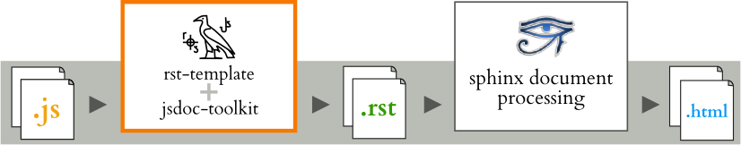

===========================
JsDoc Toolkit RST-Template
===========================

Project provides a RST (ReStructuredText) compliant templates for 
`JsDoc Toolkit`_ documentation generator, making it easy to document project's
JavaScript resources with Sphinx_.

With the custom rst -template, it is possible to generate rst-document pages using 
|jskit|. From there, the generated pages can be included as part of 
documentation, similar to `Sphinx autogen feature <http://sphinx.pocoo.org/ext/autosummary.html#sphinx-autogen-generate-autodoc-stub-pages>`_.
The process is shown in the illustration:

Installation
============

Suggested installation steps (unless you already have some of the apps/modules installed)

#. Install Java and Ant:

   - `Download Java <http://www.oracle.com/technetwork/java/javase/downloads/index.html>`_  and extract it for
     example to `/opt/java/`
   - `Download Ant <http://ant.apache.org/bindownload.cgi>`_ and extract it for example to `/opt/apache-ant/`

#. Install `JsDoc Toolkit`_:

   - Download release: http://jsdoc-toolkit.googlecode.com/files/jsdoc_toolkit-2.4.0.zip
   - Extract package for example to: ``/opt/jsdoc-toolkit/``

#. Setup `JsDoc Toolkit RST Template <http://code.google.com/p/jsdoc-toolkit-rst-template/>`_

   - Download the package (not yet available) or `checkout the sources <http://code.google.com/p/jsdoc-toolkit-rst-template/source/checkout>`_:
   - Open ``build.properties`` for editing and set the directories:

     - Where to find JsDoc Toolkit
     - Where to read javascript sources
     - Where to generate rst documents

     .. code-block:: ini

        # Directory where the jsdoc-toolkit is installed
        jsdoc-toolkit.dir=/opt/jsdoc-toolkit

        # Directory where to find javascript sources
        js.src.dir=src/js

        # Directory where to generate rst files
        js.rst.dir=dist/rst

     .. TIP::

        You can also pass these values as a parameter to Ant::

          ant -Djs.src.dir=somewhere/else build

#. Test the setup to ensure everything works:

   - List Ant tasks::

       ant -p

   - Try out the js conversion by building the .js -sources::

       ant build

   - See the outcode directory defined by ``js.rst.dir``

.. NOTE::

   This document only describes how to generate RST-files from JavaScript -sources.
   Please follow the Sphinx_ -official documentation for how to write and
   configure documentation.

Usage
=====
As it can be seen from the illustration, generating the JavaScript -source API into Sphinx
powered documentation, it requires a tool chain:

.. contents::
   :local:

Comment your code
-----------------
Javascript source code, commented using |jskit| commenting conventions.

.. code-block:: javascript

  /**
  * @class
  * Comment block
  *
  * @param {string} name Unique name for the app
  */
  var App = function (name) {
    // @default "Anonymous"
    this.name = name || 'Anonymous';
  };

  /**
   * Runs the app
   * @returns {App} itself bac
   */
  App.run = function() {
    return this;
  }

Generate API documents
-----------------------
Build RST documents from source code with either directly with JSDoc Toolkit or Ant script:

.. code-block:: bash

  ant -Djs.src.dir=src/myapp -Djs.rst.dir=doc/api/myapp  build

After generating the source code with custom template, the outcome is something like (in this case, the file name is
``api/myapp/symbols/App.rst``):

.. code-block:: rst

  .. js:class:: App (name)

      Comment block

      :param string name:

         Unique name for the app

      .. js:function:: App.run ()

         Runs the app

.. NOTE::

   You may edit the generated RST API documents, if you like. However, that prevents you re-generating the documents from
   the sources again (unless you are willing to do some manual merging). Which approach you should use, depends on needed
   documentation.

Write documentation
-------------------
Now, both generated and manually written documentation can be used together.
The documentation structure may be as follows::

  conf.py
  index.rst
  api/
    index.rst
    symbols/
      _global_.rst
      App.rst

To include API documents in Sphinx document tree, the suggested method is to set ``api/index`` -toctree
somewhere in master document:

.. code-block:: rst

  .. toctree::

     api/index

Then, you may refer documented classes, functions and other JavaScript elements by
`using Sphinx notation <http://sphinx.pocoo.org/domains.html#the-javascript-domain>`_:

.. code-block:: rst

  The application is implemented in class :js:class:`App`,
  where as the actual processing is done in :js:func:`App.run`.
  To see the complete API, see :ref:`separate API document <api>`.

Examples
========
Following documents are generated using the RST template:

.. toctree::
   :maxdepth: 2
   :glob:

   api/myapp/index
   api/jsdoc-toolkit/index
   api/template/index

License: MIT
============
This piece of software is `MIT licensed <http://www.opensource.org/licenses/mit-license.php>`_.
It means you can freely take it, :ref:`hack it <devel>`  and break it - both in personal and commercial use.

This also means :ref:`your contribution is welcome <devel>`

.. toctree::
   :hidden:

   devel

.. |tmpl| replace:: JsDoc Toolkit RST -template
.. |jskit| replace:: JsDoc Toolkit
.. _Sphinx: http://sphinx.pocoo.org/
.. _Python: http://www.python.org/
.. _JsDoc Toolkit: http://code.google.com/p/jsdoc-toolkit/
.. _Java: http://java.sun.com/